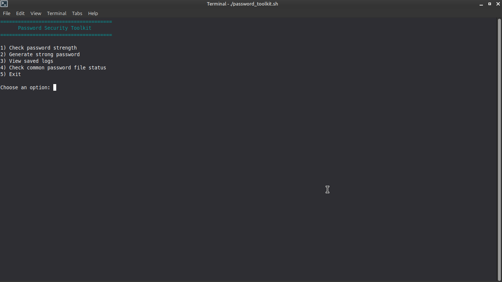
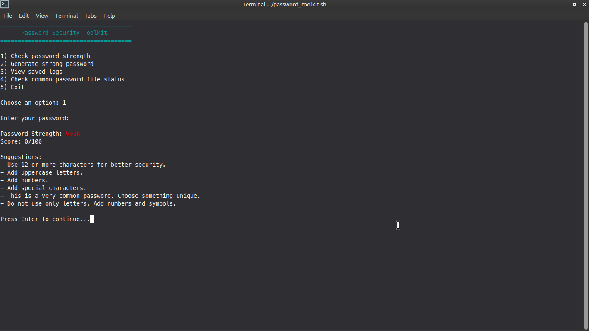
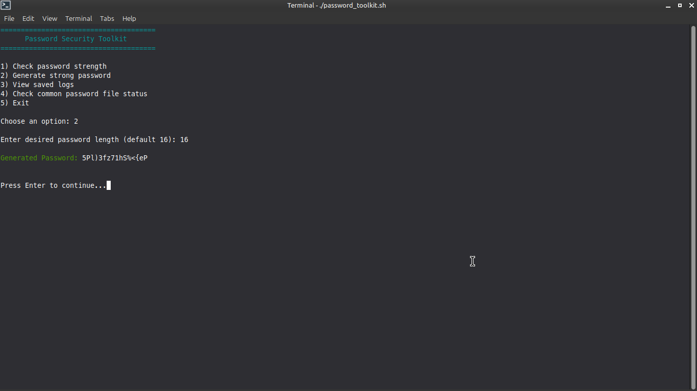
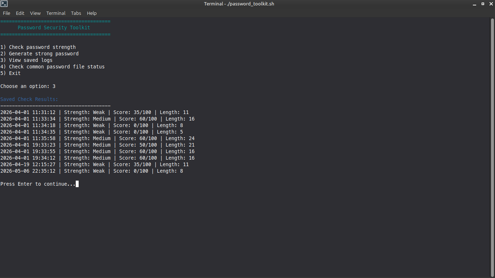
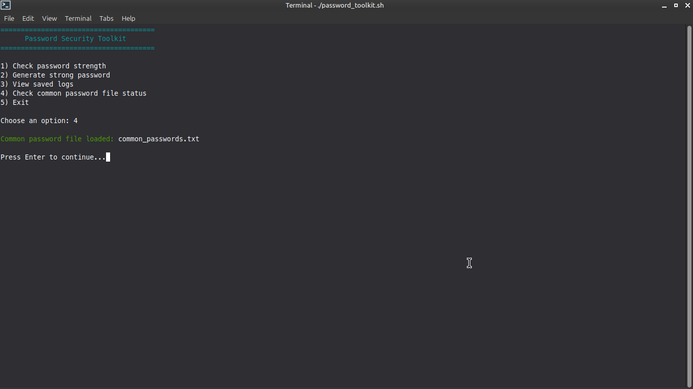

# Password Security Toolkit

A Bash-based password security toolkit designed for password strength auditing and security awareness. Checks passwords against a customizable common-password wordlist, provides real-time color-coded scoring with actionable feedback, and securely logs assessment results for system hardening and educational purposes.

## Features

-  **Password Strength Checking** - Validates against common password wordlist
-  **Color-Coded Output** - Visual feedback with RED, GREEN, YELLOW, and CYAN indicators
-  **Scoring System** - Quantitative password strength evaluation
-  **Actionable Feedback** - Specific recommendations for improvement
-  **Audit Logging** - Securely logs password checks to `logs/password_checker.log`
-  **Banner Display** - Professional terminal interface
-  **Educational Tool** - Teaches password security best practices

## Technologies Used

- Bash
- Linux command-line tools:
  - echo (with ANSI color codes)
  - read (user input handling)
  - grep (pattern matching)
  - mkdir (directory creation)
  - Standard Bash string manipulation

## 🔧 Usage

```bash
# Make the script executable
chmod +x password_toolkit.sh

# Run the toolkit
./password_toolkit.sh
```

## Project Purpose

This project was built to practice:

- Bash scripting and automation
- Password security fundamentals
- Color-coded terminal output formatting
- File I/O operations and logging
- User input validation
- Cybersecurity awareness

---

## Sample Use Case
This tool can be used to quickly:

- Test password strength against common wordlists
- Identify weak passwords in educational environments
- Demonstrate password security best practices
- Audit password policies for compliance
- Learn about common password vulnerabilities

---

## Screenshots

Example output:







---

## Future Improvements

- Add password generation feature using /dev/urandom
- Implement customizable wordlist support
- Add password complexity requirements (length, special chars, etc.)
- Export reports in multiple formats (JSON, CSV)
- Add entropy calculation for password strength
- Implement GUI interface with dialog/zenity
- Add multi-language support

---

## ⚠️ Disclaimer
This tool is intended for educational and authorized use only. Do not use it on systems you do not own or have permission to test. Always obtain proper authorization before auditing passwords or security systems.

---

## Skills Demonstrated
- Bash scripting
- Cybersecurity fundamentals
- Password security concepts
- Terminal UI/UX design
- Logging and auditing
- Problem-solving and automation

---

## Author
Kian Bahia 🔗 [GitHub Profile](https://github.com/k14nx0)

---

## License

This project is for educational purposes.

